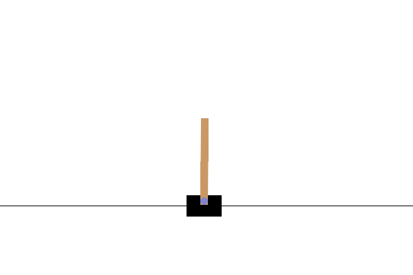

# RL Algorithms in Continuous State Spaces

This repository implements various Reinforcement Learning (RL) algorithms to solve environments with continuous state spaces, such as **CartPole** and **Acrobot**. It explores both policy-based and value-based methods to tackle these problems effectively.

## Implemented Algorithms
- **Policy-Based:**
  - Proximal Policy Optimization (PPO)
  - REINFORCE with baseline
  - Actor-Critic

- **Value-Based:**
  - Semi-Gradient N-Step SARSA

## Environments
- **CartPole** 
- **Acrobot** 

## Repository Structure
- `ActorCritic.py`: Implementation of the Actor-Critic algorithm.
- `cartpole_ppo.py`: PPO implementation for CartPole.
- `acrobot_ppo.py`: PPO implementation for Acrobot.
- `semigradnstepSarsa.py`: Semi-Gradient N-Step SARSA implementation.
- `cm_MCTS.py`: Supporting Monte Carlo Tree Search module. [Experiment]
- **Results and Logs**:
  - Contains visualizations of reward trends, mean and standard deviations, and hyperparameter analysis.

## How to Run
1. Clone the repository:
   ```bash
   git clone https://github.com/muktac5/RL_Algorithms_Continuous_State_Spaces.git
   cd RL_Algorithms_Continuous_State_Spaces
   ```
3. Run an algorithm:
   ```bash
   python cartpole_ppo.py
   ```

## Results
##REINFORCE with Baseline results:
### Cartpole :


### Acrobot : 


## Proximal policy optimization Results : 
### Cartpole : 


### Acrobot : 


